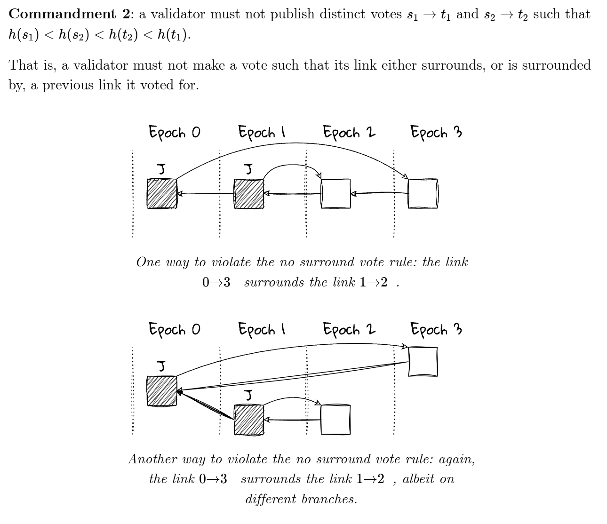

## Proof of Staked Authority(POSA)

POSA:DPOS+POA

BSC here proposes to combine DPoS and PoA for consensus, so that:

1. Blocks are produced by a limited set of validators
2. Validators take turns to produce blocks in a PoA manner, similar to [Ethereum’s Clique](https://eips.ethereum.org/EIPS/eip-225) consensus design
3. Validator set are elected in and out based on a staking based governance

## Fast Finality

It takes several steps to finalize a block:

1. A block is proposed by a validator and propagated to other validators(单个验证者提出区块并广播)

   Validators use their BLS private key to sign for the block as a vote message(投票消息为BLS签名)

2. Gather the votes from validators into a pool(票池收集所有票数，本地会维护一个票池，通过网络同步)

3. Aggregate the BLS signature if its direct parent block has gotten enough votes when proposing a new block（带有BLS私钥的直接父区块在提议新区块时获得了足够的票数，则聚合 BLS 签名）

4. Set the aggregated vote attestation into the extra field of the new block's header(聚合签名成为证明保存至块头)

5. Validators and full nodes who received the new block with the direct parent block's attestation can justify the direct parent block(收到带有直接父区块证明的新区块的验证者和完整节点可以证明直接父区块的正确性)

6. If there are two continuous blocks have been justified, then the previous one is finalized(如果有两个连续的区块已证明合理，则前一个区块最终确定)

### Finality Rules：n+1和n+2两个区块有证明则n被确认

justify:

(1) it is the root, or

(2) there exists attestation for this block in its direct child’s header, we call this block justified（直接子块包含证明则这个块为justified block）

finalize:

(1) it is the root, or

(2) it is justified and its direct child is justified（该块和子块为justified block）

### 投票的结构：一般表示为[SourceNumber->TargetNumber]比如[1->2]

```go
SourceNumber: justifiedBlockNumber,
SourceHash:   justifiedBlockHash,
TargetNumber: parent.Number.Uint64(),
TargetHash:   parent.Hash(),
```

#### 获取Justified block：最新包含证明块的Target指向块

```go
func (p *Parlia) GetJustifiedNumberAndHash(){
	...
	head := headers[len(headers)-1]
	snap= p.snapshot(chain, head.Number.Uint64(), head.Hash(), headers)
	if snap.Attestation == nil {
		return 0, chain.GetHeaderByNumber(0).Hash(), nil
	}
	return snap.Attestation.TargetNumber, snap.Attestation.TargetHash, nil
}
```

#### 获取finalized block：最新包含证明块的Source指向块

```go
func (p *Parlia) GetFinalizedHeader(){
	snap, err := p.snapshot(chain, header.Number.Uint64(), header.Hash(), nil)
	if snap.Attestation == nil {
		return chain.GetHeaderByNumber(0) // keep consistent with GetJustifiedNumberAndHash
	}
	return chain.GetHeader(snap.Attestation.SourceHash, snap.Attestation.SourceNumber)
}
```

#### assembleVoteAttestation

```go
func (p *Parlia) assembleVoteAttestation(){
	if p.VotePool == nil {
		return 
	}
	parent := chain.GetHeaderByHash(header.ParentHash)
	snap, err := p.snapshot(chain, parent.Number.Uint64()-1, parent.ParentHash, nil)
	votes := p.VotePool.FetchVoteByBlockHash(parent.Hash())
	if len(votes) < 2/3 {
		return 
	}
	justifiedBlockNumber, justifiedBlockHash := p.GetJustifiedNumberAndHash(chain, []*types.Header{parent})
	attestation := &types.VoteAttestation{
		Data: &types.VoteData{
			SourceNumber: justifiedBlockNumber,
			SourceHash:   justifiedBlockHash,
			TargetNumber: parent.Number.Uint64(),
			TargetHash:   parent.Hash(),
		},
	}
}
```

### Validator Vote Rules

投票时机为验证者在收到新区块时进行投票（即使先收到当前高度的其他验证者的出块也会直接投票，并不是优先自己出的块）

- A validator must not publish two distinct votes for the same height. (Rule 1)（验证者最多必须对任何目标 epoch 进行一次投票）
- A validator must not vote within the span of its other votes . (Rule 2)（不可以同时投出类似[2->3]和[1->4]的票）
- Validators always vote for their canonical chain’s latest block. (Rule 3)



#### 投票保存范围

```go
// votes in the range (currentBlockNum-256,currentBlockNum+11] will be stored
lowerLimitOfVoteBlockNumber = 256
upperLimitOfVoteBlockNumber = 11 // refer to fetcher.maxUncleDist
```

#### core/vote/votemanager.go：投票主函数

```go
func (voteManager *VoteManager) loop() {
	log.Info("vote manager routine loop started")
	defer voteManager.chainHeadSub.Unsubscribe()
	defer voteManager.syncVoteSub.Unsubscribe()

	events := voteManager.eth.EventMux().Subscribe(downloader.StartEvent{}, downloader.DoneEvent{}, downloader.FailedEvent{})  //订阅与下载器相关的事件（StartEvent、DoneEvent、FailedEvent），以便在这些事件发生时触发相应的逻辑
	defer func() {
		log.Debug("vote manager loop defer func occur")
		if !events.Closed() {
			log.Debug("event not closed, unsubscribed by vote manager loop")
			events.Unsubscribe()
		}
	}()

	dlEventCh := events.Chan()  //获取事件通道 dlEventCh，用于接收下载器相关的事件

	startVote := true
	blockCountSinceMining := 0
	var once sync.Once
	for {
		select {
		case ev := <-dlEventCh:
			if ev == nil {
				log.Debug("dlEvent is nil, continue")
				continue
			}
			switch ev.Data.(type) {
			case downloader.StartEvent:
				log.Warn("downloader is in startEvent mode, will not startVote")
				startVote = false
			case downloader.FailedEvent:
				log.Info("downloader is in FailedEvent mode, set startVote flag as true")
				startVote = true
			case downloader.DoneEvent:
				log.Info("downloader is in DoneEvent mode, set the startVote flag to true")
				startVote = true
			}
		case cHead := <-voteManager.chainHeadCh:
			if !startVote {
				log.Warn("startVote flag is false, continue")
				continue
			}
			if !voteManager.eth.IsMining() {
				blockCountSinceMining = 0
				log.Warn("skip voting because mining is disabled, continue")
				continue
			}
			blockCountSinceMining++
			if blockCountSinceMining <= blocksNumberSinceMining {
				//检查挖矿状态: 挖矿个数小于设定跳过投票
				log.Warn("skip voting", "blockCountSinceMining", blockCountSinceMining, "blocksNumberSinceMining", blocksNumberSinceMining)
				continue
			}

			if cHead.Block == nil {
				log.Warn("cHead.Block is nil, continue")
				continue
			}

			curHead := cHead.Block.Header()
			// Check if cur validator is within the validatorSet at curHead
			if !voteManager.engine.IsActiveValidatorAt(voteManager.chain, curHead,
				func(bLSPublicKey *types.BLSPublicKey) bool {
					return bytes.Equal(voteManager.signer.PubKey[:], bLSPublicKey[:])
				}) {
				log.Warn("cur validator is not within the validatorSet at curHead")
				continue
			}

			// Add VoteKey to `miner-info`
			once.Do(func() {
				log.Info("Add VoteKey to 'miner-info'")
				minerInfo := metrics.Get("miner-info")
				if minerInfo != nil {
					minerInfo.(metrics.Label).Value()["VoteKey"] = common.Bytes2Hex(voteManager.signer.PubKey[:])
				}
			})

			// 创建投票数据，并签名。
			log.Info("start voting")
			vote := &types.VoteData{
				TargetNumber: curHead.Number.Uint64(),
				TargetHash:   curHead.Hash(),
			}
			voteMessage := &types.VoteEnvelope{
				Data: vote,
			}

			// 如果签名和写入日志都成功，将投票消息放入投票池。
			if ok, sourceNumber, sourceHash := voteManager.UnderRules(curHead); ok {//检查是否符合投票规则
				log.Info("curHead is underRules for voting")
				if sourceHash == (common.Hash{}) {
					log.Info("sourceHash is empty")
					continue
				}

				voteMessage.Data.SourceNumber = sourceNumber
				voteMessage.Data.SourceHash = sourceHash

				if err := voteManager.signer.SignVote(voteMessage); err != nil {
					log.Error("Failed to sign vote", "err", err, "votedBlockNumber", voteMessage.Data.TargetNumber, "votedBlockHash", voteMessage.Data.TargetHash, "voteMessageHash", voteMessage.Hash())
					votesSigningErrorCounter.Inc(1)
					continue
				}
				if err := voteManager.journal.WriteVote(voteMessage); err != nil {
					log.Error("Failed to write vote into journal", "err", err)
					voteJournalErrorCounter.Inc(1)
					continue
				}

				log.Info("vote manager produced vote", "votedBlockNumber", voteMessage.Data.TargetNumber, "votedBlockHash", voteMessage.Data.TargetHash, "voteMessageHash", voteMessage.Hash())
				voteManager.pool.PutVote(voteMessage)
				votesManagerCounter.Inc(1)
			}
		case event := <-voteManager.syncVoteCh://从 syncVoteCh 通道中获取同步投票事件
			voteMessage := event.Vote
			if voteManager.eth.IsMining() || !bytes.Equal(voteManager.signer.PubKey[:], voteMessage.VoteAddress[:]) {
				continue
			}
			if err := voteManager.journal.WriteVote(voteMessage); err != nil {
				log.Error("Failed to write vote into journal", "err", err)
				voteJournalErrorCounter.Inc(1)
				continue
			}
			log.Info("vote manager synced vote", "votedBlockNumber", voteMessage.Data.TargetNumber, "votedBlockHash", voteMessage.Data.TargetHash, "voteMessageHash", voteMessage.Hash())
			votesManagerCounter.Inc(1)
		case <-voteManager.syncVoteSub.Err():
			log.Debug("voteManager subscribed votes failed")
			return
		case <-voteManager.chainHeadSub.Err():
			log.Debug("voteManager subscribed chainHead failed")
			return
		}
	}
}
```

## ValidatorsList：在创世区块的extra字段中获取

|---Extra Vanity---|---Validators Number and Validators Bytes (or Empty)---|---Vote Attestation (or Empty)---|---Extra Seal---|

初始状态按照地址字典顺序排序，每个epoch从智能合约中更新验证者列表

```go
//Snapshot.go
func (s *Snapshot) validators() []common.Address {
	validators := make([]common.Address, 0, len(s.Validators))
	for v := range s.Validators {
		validators = append(validators, v)
	}
	sort.Sort(validatorsAscending(validators))
	return validators
}
```

#### 判断节点是否为inturn

##### 若当前区块高度除以验证者个数的余数等于该节点在验证者集中的下标，则该节点为inturn节点

```go
func (s *Snapshot) inturn(validator common.Address) bool {
	validators := s.validators()
	offset := (s.Number + 1) % uint64(len(validators))
	return validators[offset] == validator
}
```

## Reward Rules:

奖励在每个epoch结束时按权重分配

- Validators whose vote is wrapped into the vote attestation can get one weight for reward(被包装到投票证明中的投票的验证者可以获得一个权重的奖励)
- Validators who assemble vote attestation can get additional weights. The number of weights is equal to the number of extra votes than required（进行投票证明组装的验证者可获得额外权重。权重的数量等于比所需票数多出的票数）
- The total reward is equal to the amount our system reward contract has grown over the last epoch. If the value of the system reward contract hits the upper limit, 1 BNB will be distributed

## forkchoice:

The new longest chain rule can be described as follows.

1. The fork that includes the higher justified block is considered as the longest chain.
2. When the justified block is the same, fall back to compare the sum of the “Difficulty” field.

#### core/blockchain.go

```go
//writeBlockAndSetHead函数：在插入新块时检测是否需要对链重组
func writeBlockAndSetHead(){
    currentBlock = getCurrentBlock()
	reorg, err = ReorgNeededWithFastFinality(currentBlock, block.Header())//判断justifiedNumber是否相同
    if reorg {
	// Reorganise the chain if the parent is not the head block
	if block.ParentHash() != currentBlock.Hash() {//存在分叉
		reorg(currentBlock, block); err != nil {
	}
}
        
func ReorgNeededWithFastFinality(){
	justifiedNumber = f.chain.GetJustifiedNumber(header)
	curJustifiedNumber = f.chain.GetJustifiedNumber(current)
	if justifiedNumber == curJustifiedNumber {
		return ReorgNeeded(current, header)//若justifiedNumber相同则判断难度值总和
	}
	return justifiedNumber > curJustifiedNumber, nil
}

```

#### bsc/core/forkchoice.go

```go
func (f *ForkChoice) ReorgNeeded(current *types.Header, extern *types.Header) (bool, error) {
	//分别统计新旧链难度值
	var (
		localTD  = f.chain.GetTd(current.Hash(), current.Number.Uint64())
		externTd = f.chain.GetTd(extern.Hash(), extern.Number.Uint64())
	)
	if localTD == nil || externTd == nil {
		return false, errors.New("missing td")
	}
	// Accept the new header as the chain head if the transition
	// is already triggered. We assume all the headers after the
	// transition come from the trusted consensus layer.
	if ttd := f.chain.Config().TerminalTotalDifficulty; ttd != nil && ttd.Cmp(externTd) <= 0 {
		return true, nil
	}

	// If the total difficulty is higher than our known, add it to the canonical chain
	if diff := externTd.Cmp(localTD); diff > 0 {
		return true, nil
	} else if diff < 0 {
		return false, nil
	}
	// Local and external difficulty is identical.
	// Second clause in the if statement reduces the vulnerability to selfish mining.
	// Please refer to http://www.cs.cornell.edu/~ie53/publications/btcProcFC.pdf
	reorg := false
	externNum, localNum := extern.Number.Uint64(), current.Number.Uint64()
	if externNum < localNum {
		reorg = true
	} else if externNum == localNum {//若难度值相同随机选择
		var currentPreserve, externPreserve bool
		if f.preserve != nil {
			currentPreserve, externPreserve = f.preserve(current), f.preserve(extern)
		}
		reorg = !currentPreserve && (externPreserve || f.rand.Float64() < 0.5)
	}
	return reorg, nil
}
```

## Slashing

Double Sign：一个验证者在多个具有相同高度或相同父块的块上签名；

Malicious Fast Finality Vote：验证者签署两张目标高度相同或一张选票的跨度包括另一张选票的跨度的快速终结选票；

Unavailability：验证者可能会因为任何原因，特别是硬件、软件、配置或网络问题而错过轮到自己出块的时间。系统智能合约会记录每个验证者的失误阻塞指标。如果指标超过设定的阈值，验证者的阻塞奖励将不会发给他们，而是与其他表现较好的验证者共享。

- 如果验证者在 24 小时内错过了超过 50 个区块，他们将不会获得区块奖励，反而将在其他验证者之间共享。
- 如果验证者在 24 小时内错过了超过 150 个区块：
  - **10BNB** 将从验证者的**质押** BNB 中slash
  - 被slash的 BNB 将分配给参与下一次分配的验证者的地址
  - 将验证者设置为持续时间为 **2** **天**，并将其从活跃验证者集中删除

## Produce block

#### 1: Prepare

- If (height % epoch)==0, 从合约中获取ValidatorSet

#### 2: FinalizeAndAssemble

- If the validator is not the in turn validator, will call liveness slash contract to slash the expected validator and generate a slashing transaction.
- If there is gas-fee in the block, will distribute **1/16** to system reward contract, the rest go to validator contract.

#### 3: Seal

The final step before a validator broadcast the new block.

- 如果轮不到验证者出块，则会等待一个随机时间

## Validate block

#### 1: VerifyHeader

Verify the block header when receiving a new block.

- Verify the signature in the `extraData` of `blockheader`
- Compare the block time of the and the expected block time that the signer suppose to use, will deny a that is smaller than expected. It helps to prevent a selfish validator from rushing to seal a block.`blockHeader`
- The should be the signer and the difficulty should be expected value.`coinbase`

#### 2: Finalize

- If it is an epoch block, a validator node will fetch validatorSet from BSCValidatorSet and compare it with extra_data.
- If the block is not generate by inturn validatorvalidaror, will call slash contract. if there is gas-fee in the block, will distribute 1/16 to system reward contract, the rest go to validator contract.
- The transaction generated by the consensus engine must be the same as the tx in block.

## 发现的问题

1.出块的顺序并非是节点接受区块的顺序
